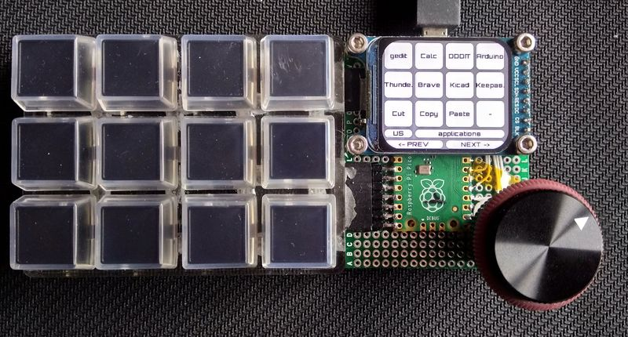

# MacroPad

## How it starts from
As a left-hander, using keyboard shortcuts is usually problematic. Many of them have to use the left hand so I have to let go of the mouse, type the key combination, pick up the mouse again, or twist my fingers to type the key combination with the right hand.  
After some research on the Internet I found the [DuckyMacroPad](https://github.com/aarnas/pico-circuit-python/tree/main/Projects/DuckyMacroPad) of a simple combination of hardware and software. 

I quickly tested it and found some limitations to what I wanted. So I forked the repository and started my own version of Macropad. Added support for a matrix keyboard and some keywords to make the scripts more versatile.

## Description of what I wanted
- a macropad with between 9 and 12 keys (not too much keys as I wanted the keypad to stay atop my keyboard)
- progammed in Python
- no daemon on the computer
- support of different keymaps (I have a desktop with a french keyboard and a laptop with a US keyboard).
- programmable macros with support for some software and easy modification of them without a specific tool.

## What I ended with
 A macropad with:
 
- Raspberry Pi Pico, running CircuitPython (as CircuitPython supports USB HID and make the Pico be viewed as an externel disk)
- 12 buttons, 9 seems a bit limited
- 1 rotary encoder, this adds some pleasant tricks like undo/redo at the turn of a button
- a 280 x 240 TFT color display, to show key affectation

## Pin allocation on the Raspberry Pi Pico
```
|        |       |    |     ┏━━━━━┓     |    |          |          |
|        |       |    |┏━━━━┫     ┣━━━━┓|    |          |          |
|        | GP0   | 1  |┃◎   ┗━━━━━┛   ◎┃| 40 |VBUS      |          |
|        | GP1   | 2  |┃◎ ▩           ◎┃| 39 |VSYS      |          |
|        | Ground| 3  |┃▣ └─GP25      ▣┃| 38 |Ground    |          |
| L1     | GP2   | 4  |┃◎  ▒▒▒        ◎┃| 37 |3v3 En    |          |
| L2     | GP3   | 5  |┃◎  ▒▒▒        ◎┃| 36 |3v3 Out   |          |
| L3     | GP4   | 6  |┃◎             ◎┃| 35 |ADC VRef  |          |
| R1     | GP5   | 7  |┃◎             ◎┃| 34 |GP28 / A2 |          |
|        | Ground| 8  |┃▣             ▣┃| 33 |ADC Ground|          |
|        | GP6   | 9  |┃◎   ▓▓▓▓▓▓▓   ◎┃| 32 |GP27 / A1 |          |
| ROT1A  | GP7   | 10 |┃◎   ▓▓▓▓▓▓▓   ◎┃| 31 |GP26 / A0 |          |
| ROT1B  | GP8   | 11 |┃◎   ▓▓▓▓▓▓▓   ◎┃| 30 |run       |          |
| ROT1S  | GP9   | 12 |┃◎   ▓▓▓▓▓▓▓   ◎┃| 29 |GP22      | TFT_BLK  |
|        | Ground| 13 |┃▣             ▣┃| 28 |Ground    |          |
| C1     | GP10  | 14 |┃◎             ◎┃| 27 |GP21      | TFT_CS   |
| C2     | GP11  | 15 |┃◎             ◎┃| 26 |GP20      | TFT_MISO |
| C3     | GP12  | 16 |┃◎             ◎┃| 25 |GP19      | NU       |
| C4     | GP13  | 17 |┃◎             ◎┃| 24 |GP18      | TFT_SCK  |
|        | Ground| 18 |┃▣             ▣┃| 23 |Ground    |          |
| R2     | GP14  | 19 |┃◎             ◎┃| 22 |GP17      | TFT_CD   |
| R3     | GP15  | 20 |┃◎    ◎ ▣ ◎    ◎┃| 21 |GP16      | TFT_RS   |
|        |       |    |┗━━━━━━━━━━━━━━━┛|    |          |          |
```
R1-3 are reserved for future use. They are parts of the 2 connectors that are connecting the keyboard to the main board

## View of the Macropad


## Detail of the display

```
╭───╮ ╭───╮ ╭───╮ ╭───╮
│ 0 │ │ 1 │ │ 2 │ │ 3 │ 
╰───╯ ╰───╯ ╰───╯ ╰───╯ 
╭───╮ ╭───╮ ╭───╮ ╭───╮
│ 4 │ │ 5 │ │ 6 │ │ 7 │ 
╰───╯ ╰───╯ ╰───╯ ╰───╯ 
╭───╮ ╭───╮ ╭───╮ ╭───╮
│ 8 │ │ 9 │ │ 10│ │ 11│ 
╰───╯ ╰───╯ ╰───╯ ╰───╯ 
LANG     Layer name
<- PREV         NEXT ->

```
| Item | Comment |
|:---|:---|
| 0..11 | The labels of the keys as extracted from the scripts|
| LANG | Displays the current selected language|
|Layer name | Shows the name of the current layer|
|PREV/NEXT | There is currently no way to dynamically change the labels for the rotary encoder.|

## Consumption
The Macropad consume 60mA with backlight at full power

## Syntax of the scripts
The scripts directory is where the script are saved.  
There is a directory for each layer which name is used as the layer's name that is displayed on the screen. Name can be any one supported by the filesystem. There is a scan of the scripts each time language is changed so if layers are added while the Macropad is running they can be recognized by simply switching the language.  
In each layer, there is one file for each key. 12 keys + rotary encoder CW and CCW fake buttons. Files are named 0 to 13.  
Scripts are using some keywords
### Keywords
#### Currently supported keywords
- `#` to add a comment. Ignored when playing the scripts
- LABEL xxxxxx  
Define the label that is printed on the key. SHALL BE THE 1rst LINE OF THE SCRIPT.  
Depending on the font's size, the label can be truncated if too long. The label can be displayed on 2 lines inserting a \n in the label but the first line is centered vertically so only half of the height of the key will be used to display,  
If no LABEL is found on the first line of the script, the label will be the key number.  
Ignored when playing the scripts
- DELAY xxxx  
define a delay of xxxx mS
- STRING xxxxxxxx  
the string xxxxxxxx is sent to the host

- DEFAULT_DELAY or DEFAULTDELAY xxxx  
sets the default delay between keys when they are sent

- REPEAT xxx  
repeat the previous line xxx times

- KEY_SEL / KEY_UNSEL  
Set the key selected or not, when selected the color is inverted. Can be used for indication of the state of a latched key (see examples)

- FLAG_SET / FLAG_RESET xxxxx  
Set/reset flag named xxxx. Will be used with IF statements

- IF / IF_NOT  xxxx  
Test if flag xxxx is set or not

- ELSE  
else statement, to be used with IF

- ENDIF  
close an IF or IF ... ELSE statement.

### Keycodes
Apart from the previous keywords a line can contain keycodes like
WINDOWS, GUI, APP, MENU, SHIFT, ALT, CONTROL, DOWNARROW, LEFTARROW, A, B, F1,....
So, to send ctrl+c one shall put `CONTROL C` on a single line
The list of the keywords can be find in the keycode libraries used

### Examples
#### Example 1
A macro to open gedit editor can be build like this
```text
LABEL Gedit
#  open launcher
ALT F2
#  wait for the popup to open
DELAY 200
#  GEDIT
STRING gedit
ENTER
```
#### Example 2
A macro to open the find dialog in gedit.  
When clicked for the first time: send CTRL+F to open the find dialog, sets the key as selected and sets a flag.  
If the flag is already set send escape to close the dialog, unselect the key, reset the flag. 
While the flag is set, it can be used to change the way the rotary encoder works and uses it to jump to next or previous words.    

```text
# Make a bistable key
IF_NOT CTRLF 
# open find dialog
CONTROL F
KEY_SEL
FLAG_SET CTRLF
ELSE
# close find dialog
ESC
KEY_UNSEL
FLAG_RESET CTRLF
ENDIF
```
Script for the CCW direction of the rotary encoder
```
LABEL NEXT ->
# if CTRLF active rotary encoder will send CTRL g (previous occurrence of word in search)
IF CTRLF
CONTROL SHIFT g
# if CTRLF not active will send CTRL z wich is undo
ELSE
CONTROL z
ENDIF
```
Keys are numbered from top left to bottom right

```
╭───╮ ╭───╮ ╭───╮ ╭───╮
│ 0 │ │ 1 │ │ 2 │ │ 3 │ 
╰───╯ ╰───╯ ╰───╯ ╰───╯ 
╭───╮ ╭───╮ ╭───╮ ╭───╮
│ 4 │ │ 5 │ │ 6 │ │ 7 │ 
╰───╯ ╰───╯ ╰───╯ ╰───╯      <--   -->
╭───╮ ╭───╮ ╭───╮ ╭───╮     ╭───╮ ╭───╮
│ 8 │ │ 9 │ │ 10│ │ 11│     │ 13│ │ 12│
╰───╯ ╰───╯ ╰───╯ ╰───╯     ╰───╯ ╰───╯
```
A macro can have any number of line. Beware, the longer the slower.  
A line can contain keywords and/or keycodes  

## Encoder pushbutton
A short push on the encoder pushbutton switches to the next layer. When reaching the last layer the count rolls back to 0.  
A long push switches the current language.

## Default configuration
The *settings.toml* file at the root of the file system can be used to specify the default language and layer.  
Settings are key pairs. One key name followed by an equal sign followed by the value in double quotes.  
Example  
```
lang="FR"
default="applications"
font="orbitron_black14.pcf"
style="ROUNDRECT"
background="ORANGE"
fill_color="0xffffff"
outline_color="GREEN"
label_color="DARKBLUE"
selected_fill="DARKGRAY"
selected_outline="RED"
selected_label="RED"
```

| key | Comment |
| :--- | :---|
|lang |Language for the keyboard either of "FR" or "US" others can be added in code.py|
|default |Layer opened by default, if missing the first layer, in alphabetical order, will be selected|
|font |Font used to display the label, if missing terminalio.FONT will be used. Fonts are supposed to be in the fonts directory. Only the filename is necessary, not a full path|
|style |Style of the buttons one of RECT, ROUNDRECT, SHADOWRECT, SHADOWROUNDRECT can not be used. If missing ROUNDRECT is used|
|background |Color of the background of the display. see color after the table|
|fill_color |Fill color of the buttons|
|outline_color |Color of the outline of the buttons|
|label_color |Color of the labels|
|selected_fill |Fill color when button is selected|
|selected_outline |Color of the outline of the buttons when selected|
|selected_label |Color of the labels when buttons are selected|

__color__: color can be a color name from the following list or an integer number either in decimal or in hexadecimal. Numbers shall be quoted too  
There is list of predefined colors in the code.  
BLACK = 0x000000  
LIGHTORANGE = 0xFF8800  
ORANGE = 0xe66100  
BROWN = 0x3F2200  
WHITE = 0xFFFFFF  
GRAY = 0x888888  
LIGHTGRAY = 0xdddddd  
DARKGRAY = 0x5e5c64  
LIGHTGREEN = 0x00FF44  
GREEN = 0x289525  
DARKGREEN = 0x19571d  
RED = 0xFF0000  
PURPLE = 0x9141ac  
YELLOW = 0xf8e45c  
LAVENDER = 0x99c1f1  
BLUE = 0x1c71d8  
DARKBLUE = 0x2e4480  
LIGHTBLUE = 0x62a0ea  

## USB drive
The Macropad can be viewed as an USB drive or not.  
By default, the USB drive mode is not active.  
To make this mode active, the user shall plug in the Macropad while keeping the rotary encoder pushed. The USB drive will then be active and the drive will be presented as CIRCUITPY. User can then modify, copy or edit any file. The drive is 1MB with around 150kB used by the default configuration so don't try to use it as a 'real thumb drive'.  

It is boot.py that tests if the rotary encoder is pushed at power on and activate or not the USB drive.
## Directory tree
Here is a picture of the directory tree on the CIRCUITPY disk.  
```text
root
     |
     |\_fonts
     |
     |\_lib
     |
     |\_scripts
     |         |
     |         |
     |         |\_layer0
     |         |        |\_0
     |         |        |\_1
     |         |        |\_..
     |         |        |\_12
     |         |        |\_13
     |         |
     |         |\_layer1
     |         |        |\_0
     |         |        |\_..
     |         |        |\_13
     |         |
     |
     |\_boot.py
     |\_code.py
     |\readme.md
     |\settings.toml
```

## Todo
### Easy
[x] Add management of key colors in the settings.toml file
[] add a keyword for the script to switch the layer. Example, selecting Gedit in the *applications* layer launches Gedit and switches to *Edition* layer
### Difficult
[] Look if it is possible to use either of icons or text in the keys without exploding memory and making software slower (Difficult as it can be very memory hungry).
[] Search a way to place multi lines of text in the keys. It is very boring to be limited to 5 or 6 caracters (difficult as it all depends on the buttons library).
